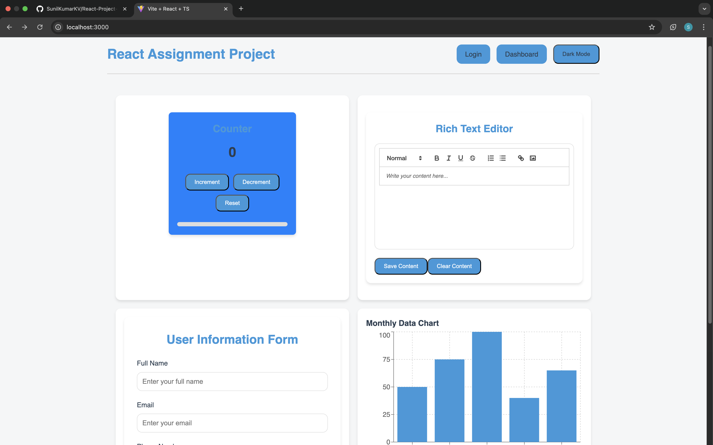

# React Web Application Assignment Project

This is a React-based web application that includes features such as a counter, user data form, rich text editor, user authentication, and dashboard visualization. It uses Vite as the build tool for fast development and includes smooth animations, responsive design, and chart visualizations.



## Features

- **User Authentication (Mock)**: The login page allows users to "sign in" using a mock Google login button.
- **Dashboard Page**: Displays the user's profile information (name, email, phone) and a chart showing user profile data.
- **User Data Form**: Allows users to input and update their personal data such as name, email, phone, and address. The form automatically saves the data to `localStorage`.
- **Rich Text Editor**: A rich text editor (using the React Quill library) allows users to write and save content locally with auto-saving.
- **Charts**: Displays various charts using Recharts, based on data stored in the application state.
- **Dark Mode Toggle**: Users can toggle between dark and light modes across the application.

## Technologies Used

- React (Functional Components and Hooks)
- React Router
- Recharts (for charts)
- React Quill (for rich text editor)
- LocalStorage for persistent data
- CSS for styling and dark/light mode toggling

## Installation

### Prerequisites

Make sure you have the following installed:

- [Node.js](https://nodejs.org/en/) (which includes npm)
- [Git](https://git-scm.com/)

### Setup Instructions

1. **Clone the repository**:

   ```bash
   git clone https://github.com/your-username/react-assignment-project.git
   ```

Sure! Here’s the complete README.md file that you can use for your GitHub project:

markdown
Copy

# React Assignment Project

This project is a React application that demonstrates user data management, chart visualization, rich text editing, and a dark/light mode toggle. It is built using React, React Router, and Recharts for the charting component.

## Features

- **User Authentication (Mock)**: The login page allows users to "sign in" using a mock Google login button.
- **Dashboard Page**: Displays the user's profile information (name, email, phone) and a chart showing user profile data.
- **User Data Form**: Allows users to input and update their personal data such as name, email, phone, and address. The form automatically saves the data to `localStorage`.
- **Rich Text Editor**: A rich text editor (using the React Quill library) allows users to write and save content locally with auto-saving.
- **Charts**: Displays various charts using Recharts, based on data stored in the application state.
- **Dark Mode Toggle**: Users can toggle between dark and light modes across the application.

## Technologies Used

- React (Functional Components and Hooks)
- React Router
- Recharts (for charts)
- React Quill (for rich text editor)
- LocalStorage for persistent data
- CSS for styling and dark/light mode toggling

## Installation

### Prerequisites

Make sure you have the following installed:

- [Node.js](https://nodejs.org/en/) (which includes npm)
- [Git](https://git-scm.com/)

### Setup Instructions

1. **Clone the repository**:

   ```bash
   git clone https://github.com/your-username/react-assignment-project.git

   ```

2. **Navigate to the project folder:**

```bash
cd react-assignment-project
```

3. **Install dependencies:**
   Run the following command to install the required dependencies:

```bash
npm install
```

4. **Start the development server:**
   Run the following command to start the development server:

```bash
npm start
```

5. Open your browser:

## Visit http://localhost:3000 to view the application in your browser.

## Project Structure

The project structure is organized as follows:

```bash
public/
src/
  components/
    ChartComponent.tsx
    counter.tsx
    Dashboard.tsx
    Layout.tsx
    RichTextEditor.tsx
    UserDataForm.tsx
  contexts/
    AuthContext.tsx
  hooks/
    useLocalStorage.ts
  pages/
    DashboardPage.tsx
    HomePage.tsx
    LoginPage.tsx
  routes/
    PrivateRoute.tsx
  styles/
    global.css
  types/
    user.tsx
  utils/
    generateUserId. ts
App.tsx
main. lsx
```
